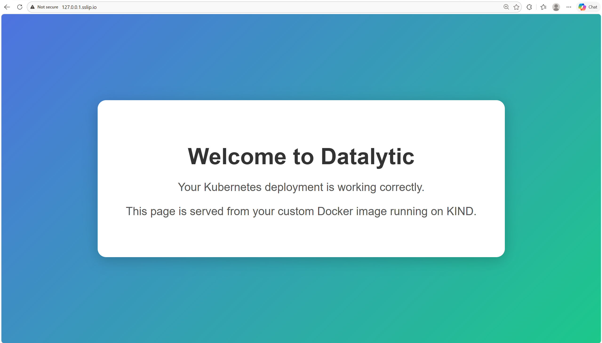

## 🐳 Kubernetes Portfolio — Minikube · KIND · Helm

## 📌 Project Overview

A lightweight Kubernetes portfolio demonstrating three core concepts:

- **Minikube basics** — simple local deployment demos  
- **KIND static website deployment** — full local web hosting pipeline  
- **Helm‑based deployment** — templated, repeatable deployment of the same KIND website

---

## 🛠️ Tech Stack

- **Minikube** — simple local K8S runtime
- **KIND** — local multi‑node cluster  
- **Helm** — templated deployments  
- **Docker** — build Nginx website image  
- **Ingress‑NGINX** — route external traffic  
- **HTML/CSS** — static website content

---

## 📁 Repository Structure

```
k8s-portfolio/
│
├── helm/                        # Helm chart for templated deployment
│   ├── Chart.yaml               # Helm chart metadata
│   ├── values.yaml              # Configurable values (image, host, ports)
│   └── templates/               # Helm templates rendered into K8s manifests
│       ├── deployment.yaml      # Templated Deployment
│       ├── service.yaml         # Templated Service
│       └── ingress.yaml         # Templated Ingress
│
├── kind/                        # Full static website deployment on KIND
│   ├── Website/                 # Static HTML/CSS site content
│   │   ├── index.html           # Main webpage
│   │   └── style.css            # Styling
│   ├── Dockerfile               # Build Nginx image serving Website/
│   ├── deployment.yaml          # Nginx Deployment
│   ├── ingress.yaml             # Ingress for 127.0.0.1.sslip.io
│   ├── kind-config.yaml         # KIND cluster + local registry config
│   ├── kind-deployment.yaml     # Auto‑generated Deployment (demo)
│   ├── kind-service.yaml        # Auto‑generated Service (demo)
│   ├── nginx.conf               # Custom Nginx config
│   └── service.yaml             # Service exposing Nginx
│
├── minikube/                    # Lightweight Minikube demo
│   ├── deployment.yaml          # Simple Deployment example
│   ├── namespace.yaml           # Demo namespace
│   └── service.yaml             # Demo Service
│
└── README.md                    # Project documentation
```

---

## 🔧 Minikube Demo

A lightweight local Kubernetes environment used to practice core workflows, including:
- Creating namespaces  
- Deploying a simple application  
- Checking pod health & logs  

### **Why Minikube?**

- **Lightweight single‑node Kubernetes**, ideal for learning core concepts  
- **Fast startup**, perfect for practicing basic manifests  
- **Simple local environment** for namespaces, deployments, and services  
- **Great for beginners**, before moving to multi‑node setups like KIND  

### **Components**

- `namespace.yaml` — create an isolated environment  
- `deployment.yaml` — run a simple multi‑pod application  
- `service.yaml` — expose the app inside the cluster  

### **1. Install Minikube**
```
curl -LO https://github.com/kubernetes/minikube/releases/latest/download/minikube-linux-amd64
sudo install minikube-linux-amd64 /usr/local/bin/minikube && rm minikube-linux-amd64
minikube version
```

### **2. Start Minikube**
```
minikube start --driver=docker
```

### **3. Create namespaces**
```
kubectl apply -f namespace.yaml
kubectl get namespaces
```

### **4. Deploy the application**
```
kubectl apply -f deployment.yaml
kubectl get deployments -n development
kubectl get pods -n development
```

### **5. Expose the application**
```
kubectl apply -f service.yaml
kubectl get services -n development
```

### **6. Inspect resources**
```
kubectl describe pod <pod-name> -n development
```

### **7. Clean up**
```
kubectl delete -f service.yaml
kubectl delete -f deployment.yaml
kubectl delete -f namespace.yaml
minikube delete
```

---

## 🖥️ KIND Static Website Deployment

A full static‑website deployment pipeline running on KIND, a local multi‑node Kubernetes cluster inside Docker.  
This section builds a custom Nginx image, pushes it to a local registry, creates a KIND cluster configured to use that registry, and deploys the website using standard Kubernetes manifests. 

### **Why KIND?**

- **Runs a real multi‑node Kubernetes cluster locally (inside Docker)**  
- **Fast to create / delete**, ideal for iterative development  
- **Supports local container registries**, enabling rapid image testing  
- **Matches production‑grade Kubernetes behavior** (Deployments, Services, Ingress)  
- **Perfect for testing static websites, custom images, and cluster networking**  

### **Components**

- **Website/** — static HTML/CSS site  
- **Dockerfile** — builds the Nginx image serving the site  
- **nginx.conf** — minimal custom config  
- **deployment.yaml** — Nginx pod  
- **service.yaml** — NodePort service  
- **ingress.yaml** — public entrypoint via `127.0.0.1.sslip.io`  
- **kind-config.yaml** — KIND cluster + local registry mirror  

### **Architecture**

```
Browser → 127.0.0.1.sslip.io
        → Ingress-NGINX
        → Service (NodePort)
        → Deployment (Nginx Pod)
        → Static Website (index.html)
```

### **1. Install KIND**
```
[ $(uname -m) = x86_64 ] && curl -Lo ./kind https://kind.sigs.k8s.io/dl/v0.31.0/kind-linux-amd64
chmod +x ./kind
sudo mv ./kind /usr/local/bin/kind
kind version
```

### **2. Build and publish the website image**
```
docker run -d --restart=always -p 5000:5000 --name kind-registry registry:2
docker network connect kind kind-registry

docker build -t kind-datalytic.in .
docker tag kind-datalytic.in localhost:5000/kind-datalytic.in
docker push localhost:5000/kind-datalytic.in
```

### **3. Create a KIND cluster with registry support**
```
kind create cluster --config kind-config.yaml
```

### **4. Deploy the website**
```
kubectl apply -f deployment.yaml
kubectl apply -f service.yaml
```

### **5. Ensure the image is available inside KIND**
```
kind load docker-image localhost:5000/kind-datalytic.in
kubectl rollout restart deployment datalytic-app
```

### **6. Access the website locally**
```
kubectl port-forward service/datalytic-service 8080:80
```

### **Result**

The static website is successfully deployed on the KIND cluster and can be accessed through either the Ingress host or the port‑forward tunnel:

```
http://127.0.0.1.sslip.io
```

<div align="center">
  
  <p><em>KIND-deployed website (via Ingress)</em></p>
</div>

```
http://localhost:8080
```

<div align="center">
  
  <p><em>KIND-deployed website (via port-forward)</em></p>
</div>

### **Bonus**

Kubernetes can also generate starter manifests directly from the CLI.  
These commands produce a Deployment and a NodePort Service YAML without writing them manually:

```
kubectl create deployment --dry-run=client \
  --image localhost:5000/kind-datalytic.in \
  kind-datalytic.in \
  -o yaml > kind-deployment.yaml

kubectl create service nodeport kind-datalytic.in \
  --tcp=80:80 \
  --dry-run=client \
  -o yaml > kind-service.yaml
```

---

## ⛵ Helm Deployment

This section converts the KIND deployment into a reusable **Helm chart**, using Helm’s template‑based workflow to package Kubernetes manifests into a configurable, reproducible deployment.

### **What Helm adds?**

- **Template‑based Deployment / Service / Ingress**  
- **Centralized configuration via `values.yaml`**  
- **One‑command install / uninstall**  
- **Reproducible, versioned deployments**  

### **Components**

- **Chart.yaml** — chart metadata (name, version, appVersion)  
- **values.yaml** — configurable parameters (image, service, host, ports)  
- **templates/deployment.yaml** — templated Deployment  
- **templates/service.yaml** — templated Service  
- **templates/ingress.yaml** — templated Ingress  
- **helm install / uninstall** — lifecycle management  

### **Architecture**

```
values.yaml
    ↓ (inject values)
templates/*.yaml
    ↓ (render)
helm template / helm install
    ↓
Rendered Kubernetes manifests
    ↓
Cluster (Deployment / Service / Ingress)
```

### **1. Install Helm**
```
sudo apt-get install curl gpg apt-transport-https --yes
curl -fsSL https://packages.buildkite.com/helm-linux/helm-debian/gpgkey | gpg --dearmor | sudo tee /usr/share/keyrings/helm.gpg > /dev/null
echo "deb [signed-by=/usr/share/keyrings/helm.gpg] https://packages.buildkite.com/helm-linux/helm-debian/any/ any main" | sudo tee /etc/apt/sources.list.d/helm-stable-debian.list
sudo apt-get update
sudo apt-get install helm
helm version
```

### **2. Inspect chart metadata & values**
```
helm show all .
```

### **3. Render templates (no cluster changes)**
```
helm template .
```

### **4. Deploy the chart**
```
helm install datalytic-in-website .
```

### **5. Access the website locally**
```
kubectl port-forward service/datalytic-service 8080:80
```

### **6. Remove the release**
```
helm uninstall datalytic-in-website
```

### **Result**

The same static website is successfully deployed using Helm and can be accessed through either the Ingress host or the port‑forward tunnel:

```
http://127.0.0.1.sslip.io
```

```
http://localhost:8080
```

---

## 🔮 Future Enhancements

- Multi‑environment Helm values (`values-kind.yaml`, `values-minikube.yaml`)  
- Deploy to cloud (AWS EKS) 
- Add CI/CD (GitHub Actions)  
- Add a second service or API backend  
